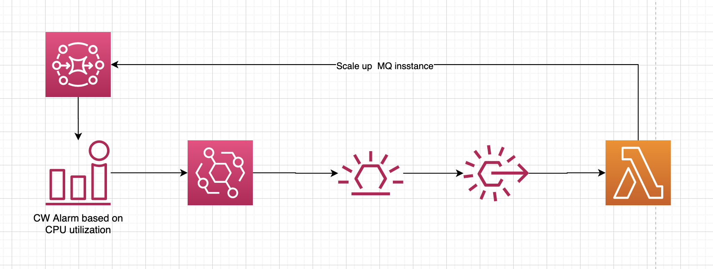

# AmazonMQ - Broker scaling utility
Serverless utility to scale up broker based on CPU utilization. The utility creates a CW alarm based on broker CPU utilization. The alarm event is captured in a EventBridge rule which triggers a lambda function. The lambda function calls a MQ broker API to update the broker instance size.



# Instructions

1. Get the broker id based om the broker name using the command below. Replace the broker name with name of your broker instance. We will use the broker id in the later steps.

```bash
aws mq list-brokers --query 'BrokerSummaries[?BrokerName==`<<REPLACE_BROKER_NAME>>`].BrokerId'
```

2. We are using a SAM template to deploy the solution. Run the following command to build the code.

```bash
sam build
```
3. We can deploy the solution by running the following command. The desired instance type will be specified as the parameter.

```bash
export AWS_REGION=$(aws --profile default configure get region)
sam deploy \
    --stack-name mq-scaling-service \
    --capabilities CAPABILITY_IAM \
    --region $AWS_REGION \
    --BrokerInstanceType <<REPLACE_WITH_INSTANCE_TYPE>> \
    --BrokerId <<REPLACE_WITH_BROKER_ID>> \
    --BrokerName <<REPLACE_WITH_BROKER_NAME>>
```
